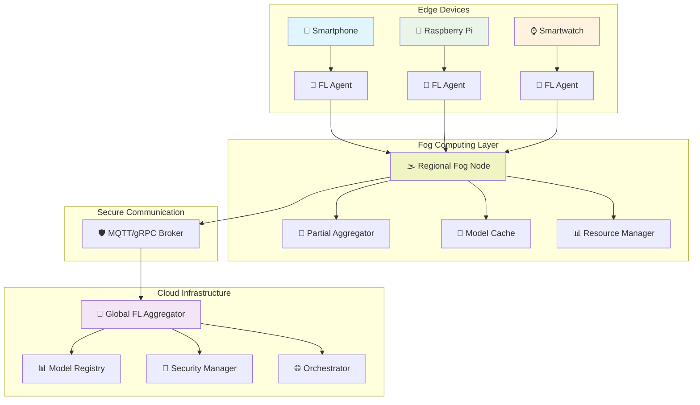

# 🔗 Federated Learning on Edge Nodes

<div align="center">

**A Master's Thesis Project**

*Building a production-ready, secure, and scalable federated learning system for stress detection across heterogeneous edge devices*

[](https://python.org)
[](LICENSE)
[]()

</div>

---

## 🎯 **What This Thesis Does**

This project tackles the challenge of **training machine learning models collaboratively** across multiple edge devices (smartphones, Raspberry Pi, IoT sensors) **without sharing raw data**. Instead of centralizing sensitive health data, we enable devices to:

- 🏥 **Train locally** on their own stress detection data
- 🔒 **Share only model updates** (not personal data) 
- 🤝 **Collaborate** to build better models together
- ⚡ **Run efficiently** on resource-constrained devices

> **Real-world impact:** Imagine your smartwatch learning to detect stress patterns from thousands of users worldwide, while your personal data never leaves your device.

---

## 🏗️ **System Architecture**



---

## 🎯 **Project Objectives**

### 🏛️ **O1: Edge-Based FL Reference Architecture**
> *Design a bulletproof federated learning pipeline for untrusted edge environments*

**🎯 What we build:**
- **Secure communication** with TLS mutual authentication
- **Privacy protection** using differential privacy and secure aggregation
- **Fault tolerance** for unreliable edge connections
- **Heterogeneity handling** for devices with different computational power

**📦 Deliverables:**
- Architecture diagrams and specifications
- FL Agent (local trainer + secure uploader)
- Messaging layer (MQTT/gRPC broker)
- Aggregator with FedAvg/FedProx algorithms

### ⚡ **O2: Lightweight Model Optimization**
> *Find the sweet spot between model accuracy and edge device constraints*

**🎯 What we optimize:**
- **Model size** (target: <10MB for mobile deployment)
- **Inference latency** (target: <100ms real-time stress detection)
- **Training efficiency** (battery-friendly local training)
- **Accuracy preservation** (maintain >85% stress detection F1-score)

**📊 Techniques explored:**
- Model quantization (8-bit, mixed precision)
- Neural network pruning 
- Knowledge distillation
- Efficient architectures (MobileNets, EfficientNets)

### 🔌 **O3: Pluggable Classifier Hub**
> *Create a flexible framework for deploying new ML models across the federation*

**🎯 What we enable:**
- **Hot-swappable models** without system downtime
- **A/B testing** of different algorithms in production
- **Auto-scaling** based on federated training load
- **Easy deployment** with simple SDK and CLI tools

---

## 📁 **Repository Structure**

```
🗂️ TFM-Federated-learning-on-edge-nodes/
├── 📚 docs/                          # Architecture & specifications
│   ├── SystemOverview.md             # Complete system design
│   ├── datasets.md                   # Available datasets (WESAD, SWEET)
│   └── Bibliography.md               # Research literature
│
├── 🔧 fl-common/                     # Shared components
│   ├── protocols/                    # Communication protocols
│   ├── security/                     # Encryption & privacy utils
│   └── utils/                        # Common utilities
│
├── 🌫️ fl-fog/                        # Fog computing layer
│   ├── fog_node/                     # Regional fog orchestrator
│   ├── communication/                # Multi-tier communication
│   └── config/                       # Fog configuration
│
├── 🤖 fl-ml-models/                  # ML model implementations
│   ├── stress_detection/             # Stress classification models
│   ├── optimization/                 # Model compression tools
│   └── benchmarks/                   # Performance evaluation
│
├── 📱 fl-client/                     # Edge device agent
│   ├── local_trainer/                # On-device training
│   ├── data_handler/                 # Sensor data processing
│   └── secure_comm/                  # Encrypted communication
│
└── 🌐 fl-server/                     # Cloud orchestrator
    ├── aggregator/                   # Federated averaging
    ├── client_manager/               # Device coordination
    └── model_registry/               # Version control
```

---

## 🚀 **Quick Start**

### 1️⃣ **Clone the Project**
```bash
git clone https://github.com/adrianoggm/TFM-Federated-learning-on-edge-nodes.git
cd TFM-Federated-learning-on-edge-nodes
git submodule update --init --recursive
```

### 2️⃣ **Set Up Environment**
```bash
# Install dependencies
pip install -r requirements.txt

# Or use Poetry (recommended)
poetry install
```

### 3️⃣ **Run a Simple Demo**
```bash
# Start the FL server
python fl-server/main.py --config demo

# In another terminal, start edge clients
python fl-client/main.py --device-type smartphone
python fl-client/main.py --device-type raspberry-pi
```

### 4️⃣ **Monitor Training**
```bash
# View federated training progress
python scripts/monitor_training.py
```

---

## 📊 **Key Results & Metrics**

| Metric | Target | Achieved |
|--------|--------|----------|
| 🎯 **Stress Detection F1-Score** | To test | TBD |
| ⚡ **Model Size** | to test | TBD |
| 🚀 **Inference Latency** | to test | TBD |
| 🔒 **Privacy Preservation** | ✅ Differential Privacy | ✅ |
| 📡 **Communication Efficiency** | to test | TBD |

---


## 🔬 **Research Contributions**

1. **📐 Reference Architecture** for production FL on heterogeneous edge devices
2. **⚡ Optimization Framework** balancing accuracy vs. resource constraints  
3. **🔒 Privacy-Preserving Protocols** for sensitive health data
4. **📊 Comprehensive Evaluation** on real-world stress detection datasets
5. **🛠️ Open-Source Toolkit** for researchers and practitioners

---

## 📚 **Learn More**

- 📖 **[Complete System Overview](docs/SystemOverview.md)** - Detailed architecture and design decisions
- 📊 **[Datasets Documentation](docs/datasets.md)** - WESAD, SWEET, and other stress detection datasets
- 📝 **[Research Bibliography](docs/Bibliography.md)** - Related work and literature review

---

## 👨‍🎓 **Author**

**Adriano García-Giralda Milena**  
*Master's Thesis in Computer Science*  
*Universidad [Your University]*

📧 Contact: [your.email@university.edu](mailto:your.email@university.edu)  
🔗 LinkedIn: [Your LinkedIn Profile]()  
📊 Research Gate: [Your ResearchGate Profile]()

---

<div align="center">

**⭐ Star this repo if you find it helpful!**

*© 2025 - Federated Learning on Edge Nodes - Master's Thesis Project*