## Introduction: Types of Federated Learning Algorithms

Federated learning (FL) enables multiple parties to collaboratively train machine learning models without sharing raw data, thus preserving privacy. According to the distribution patterns of sample space and feature space, FL algorithms are typically categorized into three types:

- **Horizontal Federated Learning:**  
  This approach is used when datasets share the same feature space but have different samples (users). For example, two hospitals in different regions collect the same type of patient data but from different individuals. Horizontal FL increases the sample size and is commonly implemented using techniques like secure aggregation, homomorphic encryption, and differential privacy to protect user privacy. Google's Android model update system is a well-known application of this type.

- **Vertical Federated Learning:**  
  Applied when datasets share the same users but have different feature spaces. For instance, a bank and an e-commerce company in the same city may have overlapping customers but collect different types of information. Vertical FL increases the feature dimension by combining complementary data from different organizations, often using privacy-preserving protocols such as secure entity alignment and encrypted model updates.

- **Federated Transfer Learning:**  
  Used when both the sample space and feature space overlap little between datasets. In this case, transfer learning techniques are introduced to leverage knowledge from related tasks or domains, enabling effective model training even with limited or non-overlapping data. This is particularly useful when organizations have small datasets or few shared features.

**Privacy Mechanisms:**  
To further protect sensitive information, federated learning systems employ privacy mechanisms such as model aggregation (to avoid sharing raw data), homomorphic encryption (to allow computation on encrypted data), and differential privacy (to add noise and prevent individual data leakage).

These FL paradigms support a wide range of machine learning models, including linear models, decision trees, and neural networks, and are adaptable to heterogeneous devices and communication architectures.
---

### Categorization Table

| Categorization                | Methods                        | Advantage                                         | Applications                                      |
|-------------------------------|-------------------------------|---------------------------------------------------|---------------------------------------------------|
| **Data partitioning**         | Horizontal federated learning | Increase user sample size                         | Android phone model update; logistic regression    |
|                               | Vertical federated learning   | Increase feature dimension                        | Decision tree; neural network                     |
|                               | Federated transfer learning   | Increase user sample size and feature dimension    | Transfer learning                                 |
| **Privacy mechanism**         | Model aggregation             | Avoid transmitting the original data              | Deep network federation learning; PATE method     |
|                               | Homomorphic encryption        | Users can calculate and process the encrypted data| Ridge regression; federated learning              |
|                               | Differential privacy          | Can successfully protect user privacy by adding noise | Traditional machine learning; deep learning    |
| **Applicable ML model**       | Linear models                 | Concise form, easy to model                       | Linear regression; ridge regression               |
|                               | Tree models                   | Accurate, stable, and can map non-linear relationships | Classification tree; regression tree          |
|                               | Neural network models         | Learning capabilities, highly robust and fault-tolerant | Pattern recognition, intelligent control     |
| **Solving heterogeneity**     | Asynchronous communication    | Solve the problem of communication delay          | Device heterogeneity                              |
|                               | Sampling                      | Avoid simultaneous training with heterogeneous equipment | Pulling Reduction with Local Compensation (PRLC) |
|                               | Fault-tolerant Mechanism      | Can prevent the whole system from collapsing      | Redundancy algorithm                              |
|                               | Heterogeneous Model           | Can solve the corresponding heterogeneous device  | (LG-FEDAVG) algorithm                             |

---

### Data Partitioning in Federated Learning

The following figure illustrates the different data partitioning strategies for horizontal, vertical, and federated transfer learning:


*Fig. 2. The different data partition of horizontal federated learning, vertical federated learning, and federated transfer learning. Adapted from C. Zhang, Y. Xie, H. Bai et al., Knowledge-Based Systems 216 (2021) 106775.*

---

## 📦 1. Repository Breakdown

| Repository    | Purpose                                   | Key Components & Description                                                                                   |
|---------------|-------------------------------------------|---------------------------------------------------------------------------------------------------------------|
| **fl-shared** | Shared logic, types, and cryptography     | - **DataWindow**: Standardizes input data<br>- **ModelDelta**: Encapsulates model updates<br>- **Interfaces**: For messaging and serialization<br>- **Crypto Helpers**: Homomorphic encryption & differential privacy |
| **fl-client** | On-device training & update publishing    | - **DataLoader**: Loads and preprocesses data<br>- **Model**: Encoder (feature extractor) + Head (classifier)<br>- **LocalTrainer**: Handles training logic<br>- **Updater**: Computes and encrypts updates<br>- **BrokerClient**: Handles communication<br>- **FLAgent**: Orchestrates client workflow |
| **fl-server** | Orchestration, aggregation, and storage   | - **Orchestrator**: Manages training rounds<br>- **FedAvgAggregator**: Aggregates client updates<br>- **StorageClient**: Persists models<br>- **BrokerServer**: Listens for updates<br>- **API & Monitor**: Health checks and metrics |

---

## 🔧 2. Repo Details & Responsibilities

### 2.1 **fl-shared**

> **Purpose:** Houses all code shared between client and server, ensuring consistency and security.

- **Data Models**
    - `DataWindow`: Represents a single data sample, including features, label, and metadata (e.g., timestamp, sensor ID).
    - `ModelDelta`: Contains model parameter updates (Δθ) and associated client identifiers.
- **Interfaces**
    - `IMessageBroker`: Abstracts publish/subscribe messaging (e.g., MQTT, gRPC).
    - `ISerializer`: Handles data serialization/deserialization (e.g., JSON, Protobuf).
- **Crypto Helpers**
    - `HEHelper`: Provides homomorphic encryption/decryption for secure aggregation.
    - `DPHelper`: Adds differential privacy noise to updates for enhanced privacy.
- **Utilities**
    - Logging setup, configuration loader, and path utilities for consistent behavior.

<details>
<summary>Directory Structure</summary>

```
fl_shared/
├─ configs.py           # Shared configuration definitions
├─ data_window.py       # DataWindow model
├─ comms_interface.py   # Messaging interfaces
├─ serialization.py     # Serialization utilities
├─ encryption/
│   ├─ homomorphic.py   # Homomorphic encryption helpers
│   └─ differential.py  # Differential privacy helpers
└─ utils.py             # Miscellaneous utilities
```
</details>

---

### 2.2 **fl-client**

> **Purpose:** Runs on edge devices, handling local data, training, and communication with the server.

- **Data Loading & Preprocessing**
    - `DataLoader`: Reads raw sensor data, applies filtering, normalization, and windowing.
- **Model Components**
    - `Encoder`: Feature extractor (e.g., 1D-CNN or autoencoder).
    - `StressHead`: Dense classifier for stress detection.
- **Training Logic**
    - `LocalTrainer`: 
        1. Pretrains the encoder on local data.
        2. Fine-tunes the head for classification.
- **Delta & Communication**
    - `Updater`: Computes model updates (Δθ), encrypts them, and sends via `BrokerClient`.
    - `BrokerClient`: Handles network communication (MQTT/gRPC).
- **Agent Orchestration**
    - `FLAgent`: Coordinates training phases, handles retries, and manages workflow.

<details>
<summary>Directory Structure</summary>

```
fl_client/
├─ client_config.py     # Client-specific configuration
├─ data_loader.py       # Data loading and preprocessing
├─ model.py             # Encoder and head model definitions
├─ trainer.py           # Local training logic
├─ updater.py           # Update computation and encryption
├─ broker_client.py     # Communication with server
└─ agent.py             # Orchestration of client workflow
```
</details>

---

### 2.3 **fl-server**

> **Purpose:** Central server for orchestrating rounds, aggregating updates, and managing model storage.

- **Round Control**
    - `Orchestrator`: Selects clients, enforces timeouts, and triggers training phases.
- **Aggregation**
    - `FedAvgAggregator`: Computes weighted average of client updates for global model.
- **Checkpoint Storage**
    - `StorageClient`: Saves and loads models to/from cloud storage (e.g., S3, GCS), manages versioning.
- **Broker Listener**
    - `BrokerServer`: Subscribes to update topics (e.g., “encoder/delta”, “head/delta”).
- **Health & Metrics**
    - `API`: Provides endpoints for health checks (`/health`) and metrics (`/metrics`).
    - `Monitor`: Exports metrics for monitoring (e.g., Prometheus).

<details>
<summary>Directory Structure</summary>

```
fl_server/
├─ server_config.py     # Server configuration
├─ orchestrator.py      # Round management
├─ aggregator.py        # Aggregation logic
├─ broker_server.py     # Message broker listener
├─ storage_client.py    # Model storage interface
├─ api.py               # Health and metrics API
└─ monitor.py           # Monitoring and metrics exporter
```
</details>

---

## 🔄 3. System Workflow

### **Phase I – Encoder Pre-Training**

**Clients:**
1. Run `pretrain_encoder()` on local data windows.
2. Compute and encrypt encoder updates (Δθ_enc).
3. Publish encrypted updates to the `encoder/delta` topic.

**Server:**
1. `Orchestrator` collects all Δθ_enc from clients.
2. `FedAvgAggregator` aggregates updates to form a new global encoder.
3. `StorageClient` saves the new encoder version (`encoder_vX`).
4. Notifies clients to proceed to Phase II.

---

### **Phase II – Head Fine-Tuning**

**Clients:**
1. Download the frozen encoder (`encoder_vX`).
2. Run `finetune_head()` locally.
3. Compute and encrypt head updates (Δθ_head).
4. Publish encrypted updates to the `head/delta` topic.

**Server:**
1. Collects all Δθ_head from clients.
2. Aggregates updates into the full model (`θ_full_vX`).
3. Persists and versions the new model.
4. Notifies clients that the next round is ready.

---

## 🗺️ 4. Overall Flowchart

```mermaid
flowchart TD
  subgraph CLIENTS
    direction TB
    A1[Phase I: pretrain_encoder<br/>Train encoder locally] --> A2[encrypt & send Δθ_enc<br/>Send to broker]
    A3[Phase II: finetune_head<br/>Train head locally]     --> A4[encrypt & send Δθ_head<br/>Send to broker]
  end

  subgraph BROKER["MQTT / gRPC Broker"]
    A2-->|topic encoder/delta|S1[Orchestrator.collect_encoder_deltas]
    A4-->|topic head/delta|S2[Orchestrator.collect_head_deltas]
  end

  subgraph SERVER
    S1-->AG1[FedAvgAggregator.aggregate_encoder<br/>Aggregate encoder updates]-->ST1[StorageClient.save_encoder_vX<br/>Persist encoder]
    ST1-->ORT1[Orchestrator.notify_phase2<br/>Trigger Phase II]

    S2-->AG2[FedAvgAggregator.aggregate_head<br/>Aggregate head updates]-->ST2[StorageClient.save_full_model_vX<br/>Persist full model]
    ST2-->ORT2[Orchestrator.notify_phase1<br/>Next round]
  end

```



---

## ✅ 5. Key Benefits

- **Separation of Concerns:**  
    - Shared logic in `fl-shared`  
    - Clear client/server partitioning

- **Independent Deployments:**  
    - Each repo has its own CI/CD, versioning, and permissions

- **Resilience & Security:**  
    - Cryptographic boundaries enforced in `fl-shared`  
    - Broker decouples network issues

- **Onboarding & Extensibility:**  
    - New contributors know exactly where to add features  
    - Easily swap encoder/head architectures without server changes

At the end of each training round, the orchestrator logs metrics, archives models, and alerts clients—ensuring a robust, private, and scalable FL pipeline for medical stress detection.

