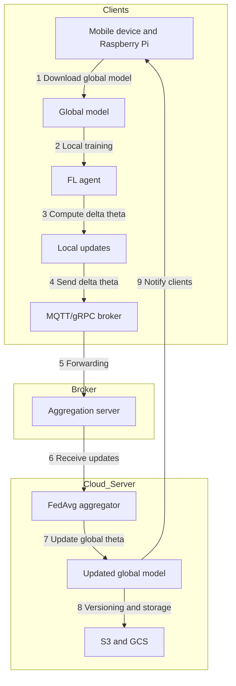
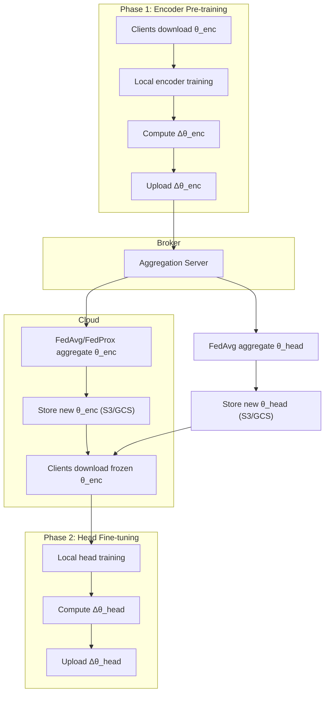

## Federated Learning System Overview

This document explains each component (node) in the federated learning pipeline and describes how data flows through the system.

### 1. Node Descriptions

- **Mobile device and Raspberry Pi**  
  Edge clients that hold private local data (e.g., sensor readings, user interactions). They perform lightweight, on-device training to compute model updates without sharing raw data.

- **Global model**  
  The current shared model checkpoint that lives in the cloud. Clients download this model at the start of each training round.

- **FL agent**  
  A software module on each client responsible for orchestrating local training. It loads the global model, runs a few epochs on local data, computes the difference (Δθ) between the updated and global weights, and packages these updates for transmission.

- **Local updates (Δθ)**  
  The computed weight differences or gradients resulting from local training. These updates contain no raw data and represent how the model should change based on the client’s private dataset.

- **MQTT/gRPC broker**  
  A messaging layer (e.g., MQTT, gRPC) that ensures reliable, possibly asynchronous delivery of client updates to the aggregation server, even under intermittent connectivity.

- **Aggregation server**  
  The cloud endpoint that collects local updates from selected clients each round. It passes these updates to the FedAvg aggregator.

- **FedAvg aggregator**  
  Implements the Federated Averaging algorithm. It computes a weighted average of client updates, typically weighted by the number of local training samples, to produce the new global model parameters.

- **Updated global model**  
  The newly aggregated model checkpoint that incorporates contributions from all clients in the current round. This model is versioned and stored for future rounds.

- **S3 and GCS**  
  Cloud storage solutions (Amazon S3, Google Cloud Storage) used to persist model checkpoints and maintain a history of global models.

### 2. System Workflow

1. **Download global model**  
   Clients fetch the latest shared model checkpoint from cloud storage or via a server API.
2. **Local training**  
   The FL agent runs a small number of training epochs on the client’s private data, producing updated weights.
3. **Compute Δθ**  
   The agent calculates the difference between the updated weights and the original global weights.
4. **Send Δθ**  
   Local updates are encrypted and sent through the messaging broker to the aggregation server.
5. **Forwarding**  
   The broker delivers client updates reliably to the aggregation endpoint.
6. **Receive updates**  
   The aggregation server gathers Δθ from all participating clients in the round.
7. **Update global theta**  
   The FedAvg aggregator computes the weighted average of client updates and updates the global model parameters.
8. **Versioning and storage**  
   The updated model checkpoint is saved back to S3/GCS with a new version tag.
9. **Notify clients**  
   Clients are signaled (e.g., via push notification or polling) that a new global model is available, triggering the next training round.

### 3. Diagram 

### 4. Bootstrapping and Iteration 0

Before any federated round, the system must establish an initial global model:

1. **No prior checkpoint:** If no model exists, the server can:
   - **Central pre‑training:** Train a seed model on available public or centralized data.  
   - **Random initialization:** Use standard weight initialization (e.g., Xavier/He).  
   - **Pre‑trained backbone:** Load a generic pre‑trained model (e.g., ImageNet, BERT) as a starting point.
2. **Publish initial model:** The seed model checkpoint (θ₀) is saved to cloud storage and versioned.  
3. **Ready for round 1:** Clients download θ₀ exactly as they would in subsequent rounds.

This “iteration 0” setup ensures a common baseline before any client‑specific updates.

### 5. Training Orchestration and Control

The central FL server (or orchestrator) coordinates the learning process through discrete rounds:

1. **Client selection.** At the start of each round, the server chooses a subset of available clients based on criteria like data freshness, connectivity, and device capacity.
2. **Model broadcast.** The server sends the current global model weights (θ_global) and a training configuration (e.g., number of local epochs, batch size, learning rate) to each selected client.
3. **Local execution trigger.** Clients receive the model and begin local training automatically under the control of the FL agent. This agent loads θ_global and the provided hyperparameters.
4. **Autonomous local training.** Each client runs training on its private data without further server intervention. The FL agent ensures training completes within resource and time budgets.
5. **Update upload.** Upon finishing, clients package their local updates (Δθ) and asynchronously upload them to the aggregation endpoint via the broker.
6. **Timeouts and fault tolerance.** The server enforces a deadline: if a client fails to return updates in time, its contributions are skipped to avoid blocking the round.
7. **Aggregation.** The FedAvg aggregator weights each Δθ by the client’s sample count and computes the new θ_global.
8. **Round completion.** The server stores the updated model, logs round metrics (e.g., number of participants, loss curves), and signals the next round.

This design ensures the central node orchestrates training without accessing raw data and can handle heterogeneous, unreliable clients gracefully.

### 6. Relation to MapReduce

While federated averaging bears conceptual similarity to the MapReduce programming model, it is not implemented via a traditional MapReduce framework (e.g., Hadoop). The analogy is:

- **Map phase**: Clients independently perform local training on their private data and emit “local updates” (Δθ), analogous to map tasks producing intermediate key-value pairs.
- **Reduce phase**: The central server collects all Δθ values and computes their weighted average to produce the new global model, analogous to reduce tasks aggregating mapped results.

However, federated learning typically uses lightweight RPC or messaging protocols (gRPC, MQTT) rather than distributed file systems and batch MapReduce engines. This design choice favors lower latency, iterative communication rounds, and elastic client participation.

### 7. Local Model Lifecycle

Each federated round, the FL agent initializes the client’s local model from the **latest global checkpoint**. The steps are:

1. **Load global weights**  
   At round start, the agent downloads θ_global and replaces any existing local weights.
2. **Fine-tuning**  
   The agent runs local training (configured epochs, batch size, learning rate) starting from θ_global. No historical local weights are reused across rounds, ensuring all clients begin from the same baseline.
3. **Update extraction**  
   After training, the agent computes Δθ = θ_local − θ_global. The raw θ_local is discarded (unless needed for personalization). Only Δθ is sent upstream.
4. **Configuration-driven behavior**  
   Hyperparameters and any local callbacks (e.g., data augmentation, early stopping) are defined in the agent’s configuration. Custom strategies (e.g., personalized layers) can persist local state across rounds, but this must be explicitly implemented in the FL agent.

This approach guarantees reproducible, stateless rounds where the server controls global progression, and client configurations govern fine-tuning behaviors.

### 8. Implementation Tools and Frameworks

You can implement this federated learning system using the following technologies:

- **Programming Languages:**  
  - Python (primary language for ML and server-side components)  
  - C++ or Python on Raspberry Pi for optimized edge inference.

- **Federated Learning Frameworks:**  
  - **Flower**: Scalable FL framework, supports custom strategies and works with TensorFlow and PyTorch.  
  - **TensorFlow Federated**: Native TFF APIs for FL in TensorFlow ecosystem.  
  - **PySyft**: Privacy-preserving ML library with FL support.

- **Edge ML Libraries:**  
  - **TensorFlow Lite** + NNAPI/GPU delegates for mobile/embedded training and inference.  
  - **PyTorch Mobile** for on-device FL workloads.

- **Messaging and Communication:**  
  - MQTT broker (e.g., Mosquitto) for lightweight publish/subscribe.  
  - gRPC over HTTP/2 for high-performance RPC.  
  - WebSockets for real-time update notifications.

- **Server and Orchestration:**  
  - **Docker** containers for components (FL server, broker).  
  - **Kubernetes** for scaling and managing services.  
  - **AWS ECS/EKS** or **GCP GKE** for managed container orchestration.

- **Cloud Services:**  
  - **AWS**: S3 for storage, Lambda/Fargate for serverless aggregation, IAM for auth.  
  - **GCP**: Cloud Storage, Cloud Functions/Run, Pub/Sub for messaging.
  
- **Security and Privacy:**  
  - TLS mutual authentication for client-server channels.  
  - JWT/OAuth2 for client identity.  
  - Differential Privacy libraries (e.g., TensorFlow Privacy) or Secure Aggregation protocols.

- **Monitoring and Logging:**  
  - **Prometheus** + **Grafana** for metrics and dashboards.  
  - **TensorBoard** for visualizing model performance over rounds.

- **CI/CD and Automation:**  
  - **GitHub Actions** or **GitLab CI** for building, testing, and deploying FL components.  
  - **Helm** charts for Kubernetes deployments.

---

This orchestration model gives the central server full control of training rounds while preserving data privacy and handling client heterogeneity.

The central FL server (or orchestrator) coordinates the learning process through discrete rounds:

1. **Client selection.** At the start of each round, the server chooses a subset of available clients based on criteria like data freshness, connectivity, and device capacity.
2. **Model broadcast.** The server sends the current global model weights (θ_global) and a training configuration (e.g., number of local epochs, batch size, learning rate) to each selected client.
3. **Local execution trigger.** Clients receive the model and begin local training automatically under the control of the FL agent. This agent loads θ_global and the provided hyperparameters.
4. **Autonomous local training.** Each client runs training on its private data without further server intervention. The FL agent ensures training completes within resource and time budgets.
5. **Update upload.** Upon finishing, clients package their local updates (Δθ) and asynchronously upload them to the aggregation endpoint via the broker.
6. **Timeouts and fault tolerance.** The server enforces a deadline: if a client fails to return updates in time, its contributions are skipped to avoid blocking the round.
7. **Aggregation.** The FedAvg aggregator weights each Δθ by the client’s sample count and computes the new θ_global.
8. **Round completion.** The server stores the updated model, logs round metrics (e.g., number of participants, loss curves), and signals the next round.

This design ensures the central node orchestrates training without accessing raw data and can handle heterogeneous, unreliable clients gracefully.

### 8.1 Relation to MapReduce

While federated averaging bears conceptual similarity to the MapReduce programming model, it is not implemented via a traditional MapReduce framework (e.g., Hadoop). The analogy is:

- **Map phase**: Clients independently perform local training on their private data and emit “local updates” (Δθ), analogous to map tasks producing intermediate key-value pairs.
- **Reduce phase**: The central server collects all Δθ values and computes their weighted average to produce the new global model, analogous to reduce tasks aggregating mapped results.

However, federated learning typically uses lightweight RPC or messaging protocols (gRPC, MQTT) rather than distributed file systems and batch MapReduce engines. This design choice favors lower latency, iterative communication rounds, and elastic client participation.

### 8.2 Local Model Lifecycle

Each federated round, the FL agent initializes the client’s local model from the **latest global checkpoint**. The steps are:

1. **Load global weights**  
   At round start, the agent downloads θ_global and replaces any existing local weights.
2. **Fine‑tuning**  
   The agent runs local training (configured epochs, batch size, learning rate) starting from θ_global. No historical local weights are reused across rounds, ensuring all clients begin from the same baseline.
3. **Update extraction**  
   After training, the agent computes Δθ = θ_local − θ_global. The raw θ_local is discarded (unless needed for personalization). Only Δθ is sent upstream.
4. **Configuration-driven behavior**  
   Hyperparameters and any local callbacks (e.g., data augmentation, early stopping) are defined in the agent’s configuration. Custom strategies (e.g., personalized layers) can persist local state across rounds, but this must be explicitly implemented in the FL agent.

This approach guarantees reproducible, stateless rounds where the server controls global progression, and client configurations govern fine‑tuning behaviors.

### 9. Implementation Tools and Frameworks. Implementation Tools and Frameworks

 Implementation Tools and Frameworks

You can implement this federated learning system using the following technologies:

- **Programming Languages:**  
  - Python (primary language for ML and server-side components)  
  - C++ or Python on Raspberry Pi for optimized edge inference.

- **Federated Learning Frameworks:**  
  - **Flower**: Scalable FL framework, supports custom strategies and works with TensorFlow and PyTorch.  
  - **TensorFlow Federated**: Native TFF APIs for FL in TensorFlow ecosystem.  
  - **PySyft**: Privacy-preserving ML library with FL support.

- **Edge ML Libraries:**  
  - **TensorFlow Lite** + NNAPI/GPU delegates for mobile/embedded training and inference.  
  - **PyTorch Mobile** for on-device FL workloads.

- **Messaging and Communication:**  
  - MQTT broker (e.g., Mosquitto) for lightweight publish/subscribe.  
  - gRPC over HTTP/2 for high-performance RPC.  
  - WebSockets for real-time update notifications.

- **Server and Orchestration:**  
  - **Docker** containers for components (FL server, broker).  
  - **Kubernetes** for scaling and managing services.  
  - **AWS ECS/EKS** or **GCP GKE** for managed container orchestration.

- **Cloud Services:**  
  - **AWS**: S3 for storage, Lambda/Fargate for serverless aggregation, IAM for auth.  
  - **GCP**: Cloud Storage, Cloud Functions/Run, Pub/Sub for messaging.
  
- **Security and Privacy:**  
  - TLS mutual authentication for client-server channels.  
  - JWT/OAuth2 for client identity.  
  - Differential Privacy libraries (e.g., TensorFlow Privacy) or Secure Aggregation protocols.

- **Monitoring and Logging:**  
  - **Prometheus** + **Grafana** for metrics and dashboards.  
  - **TensorBoard** for visualizing model performance over rounds.

- **CI/CD and Automation:**  
  - **GitHub Actions** or **GitLab CI** for building, testing, and deploying FL components.  
  - **Helm** charts for Kubernetes deployments.

---

## Federated Learning System Overview

This document describes each component in our federated-transfer learning pipeline for stress detection and shows how data moves through the system.

---

### 1. Node Descriptions

- **Hospital Edge Client**  
  Holds private 5 min windows of raw ECG/EDA/ACC features. Runs on-site training to produce model updates—no raw data ever leaves.

- **Global Encoder**  
  A shared feature extractor (e.g. 1D-CNN) stored in the cloud. Clients download it for federated pre-training.

- **Stress Classifier Head**  
  A small, client-specific layer on top of the encoder that outputs stress predictions.

- **FL Agent**  
  Client-side software that orchestrates two phases:  
  1. **Phase 1**: Federated pre-training of the encoder  
  2. **Phase 2**: Local fine-tuning of the stress head  
  It computes weight deltas (Δθ) and packages them for secure upload.

- **Local Updates (Δθ)**  
  Encrypted weight differences for encoder or head—no raw signals included.

- **MQTT/gRPC Broker**  
  Reliable messaging layer handling intermittent connectivity.

- **Aggregation Server**  
  Collects updates from selected clients each round.

- **FedAvg / FedProx Aggregator**  
  Averages client updates (weighted by sample count) into new global parameters.

- **Cloud Storage (S3/GCS)**  
  Persists encoder & head checkpoints and round metadata.

---

### 2. System Workflow

#### **Phase 1: Federated Encoder Pre-training**
1. **Download encoder**  
   Clients fetch the latest encoder (θ_enc).
2. **Local encoder training**  
   Train on raw windows (e.g. reconstruction or proxy task).
3. **Compute Δθ_enc**  
   Calculate encrypted encoder weight deltas.
4. **Upload Δθ_enc**  
   Send through broker to aggregation server.
5. **Aggregate encoder**  
   FedAvg/FedProx → new θ_enc.
6. **Version & store**  
   Save updated encoder to S3/GCS.

#### **Phase 2: Local Stress-Head Fine-tuning**
1. **Download frozen encoder**  
   Load θ_enc (no further encoder updates).
2. **Local head training**  
   Train stress classifier head on embeddings.
3. **Compute Δθ_head**  
   Calculate encrypted head weight deltas.
4. **Upload Δθ_head**  
   Send through broker.
5. **Aggregate head**  
   FedAvg → new θ_head.
6. **Version & store**  
   Save updated head for deployment.

*(Optional Phase 3: Unfreeze some encoder layers and repeat fine-tuning.)*

---

### 3. Flowchart

